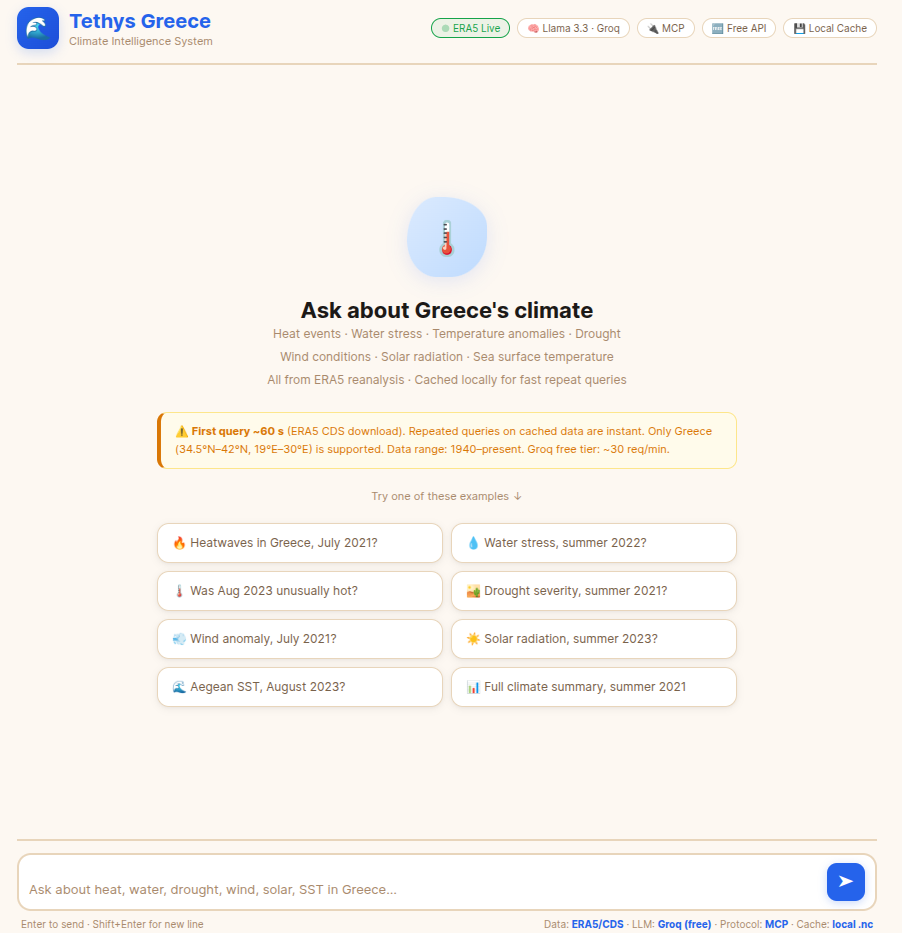
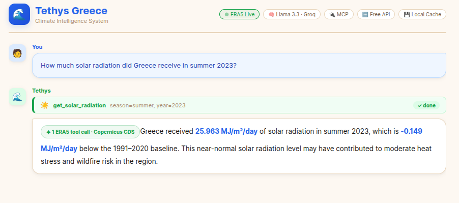

# 🌊 Tethys Greece — Climate Intelligence System

> **Open AI-powered Scientific Intelligence System** for Greece's climate, built on ERA5 reanalysis data, the Model Context Protocol (MCP), and a free Groq LLM.

A conversational climate-science assistant inspired by [ERMES](https://github.com/mixstam1821/ERMES). Ask in plain language — Tethys fetches live ERA5 data, runs the analysis, and returns grounded, citable answers.

---

## ✨ Features

| Capability | Tool | Data |
|---|---|---|
| 🔥 Heatwave detection | `get_heat_events` | ERA5 hourly t2m |
| 🌡️ Temperature anomaly | `get_temperature_anomaly` | ERA5 monthly t2m vs 1991–2020 |
| 💧 Water stress index | `get_water_stress` | ERA5 monthly evaporation + precipitation |
| 🏜️ Drought index (SPI) | `get_drought_index` | ERA5 monthly precipitation vs 1991–2020 |
| 💨 Wind speed anomaly | `get_wind_speed_anomaly` | ERA5 monthly u10/v10 + Beaufort |
| ☀️ Solar radiation | `get_solar_radiation` | ERA5 monthly SSRD → J/m²/day (MJ/m²/day) |
| 🌊 Sea surface temp | `get_sea_surface_temp` | ERA5 monthly SST, Aegean + Ionian |

**Key highlights:**

- **Pre-loaded local data** — all monthly variables (temperature, precipitation, wind, solar, SST) are stored as consolidated `.nc` files in `era5_local/` and served instantly with no CDS contact. Only `get_heat_events` (ERA5 hourly) fetches live from CDS on first use, then caches to `era5_cache/`.
- **Streaming UI** — tool calls stream to the browser in real time; you see which ERA5 variable is being fetched.
- **MCP architecture** — the ERA5 analysis runs in a separate MCP server process; the FastAPI app is the orchestrator.
- **100% free APIs** — Groq (Llama 3.3 70B) + Copernicus CDS (ERA5) are both free-tier.

---



## 🗺️ Coverage

Greece only: **34.5°N–42°N, 18°E–30°E** (land domain).  
SST uses a slightly wider box: **33°N–42°N, 18°E–30.5°E** (Aegean + Ionian).  
Data availability: **1940–present** (ERA5).

---

## 🚀 Quick Start (local)

### 1. Clone & create environment

```bash
git clone https://github.com/your-username/Tethys
cd Tethys
python -m venv .venv
```

Activate it:

**Linux / macOS**
```bash
source .venv/bin/activate
```

**Windows**
```bat
.venv\Scripts\activate
```

Then install dependencies:
```bash
pip install -r requirements.txt
```

### 2. Set API keys

Create a `.env` file in the project root:

```bash
# .env
CDS_KEY=your-copernicus-cds-key
GROQ_KEY=your-groq-key
```

Then source it:

**Linux / macOS**
```bash
export $(cat .env | xargs)
```

**Windows (PowerShell)**
```powershell
Get-Content .env | ForEach-Object { $k,$v = $_ -split '=',2; [System.Environment]::SetEnvironmentVariable($k,$v) }
```

> Never commit `.env` to git — add it to `.gitignore`.

### 3. Run

```bash
python app.py
```

Open `http://localhost:7860` in your browser.

> **Heat events (~60 s first query):** `get_heat_events` fetches ERA5 hourly data live from Copernicus CDS — only for months not yet cached locally. All other variables (temperature, precipitation, wind, solar, SST) are served from pre-loaded local `.nc` files and return **instantly**.

---

## 🐳 Docker

```bash
docker build -t tethys-greece .

docker run -p 7860:7860 \
  -e CDS_KEY=your-key \
  -e GROQ_KEY=your-key \
  -v $(pwd)/era5_local:/app/era5_local \
  -v $(pwd)/era5_cache:/app/era5_cache \
  tethys-greece
```

Both volume mounts are required: `era5_local/` serves all monthly variables instantly; `era5_cache/` persists hourly heat-event downloads between container restarts.

---

## 🤗 Deploy on HuggingFace Spaces

1. Create a new Space with **Docker** SDK.
2. Push this repo to the Space.
3. Add secrets in **Settings → Repository secrets**:
   - `CDS_KEY` — your Copernicus CDS API key
   - `GROQ_KEY` — your Groq API key
4. HuggingFace will build and run the Docker image on port 7860 automatically.

> **Persistent cache on HF Spaces:** HF Spaces have ephemeral filesystems by default. For a persistent cache, use the [HF Datasets Hub storage](https://huggingface.co/docs/hub/spaces-sdks-docker#storage) or mount a persistent volume.

---

## 🏗️ Architecture

```
Browser (ui.html)
    │  HTTP POST /ask
    ▼
FastAPI (app.py)
    │  spawns subprocess via MCP stdio
    ▼
MCP Server (server.py)
    │  Tier 1: ./era5_local/*.nc     ← instant (pre-downloaded)
    │  Tier 2: ./era5_cache/*.nc     ← instant (auto-cached after first download)
    │  Tier 3: cdsapi live download  ← ~60 s fallback
    ▼
ERA5 / Copernicus CDS
```

The LLM (Groq / Llama 3.3) orchestrates tool calls: it receives the user question, decides which ERA5 tools to call (often several), waits for results, and writes a grounded scientific answer.

---

## 📁 File Structure

```
Tethys/
├── app.py           # FastAPI server + Groq + MCP orchestration
├── server.py        # MCP tool server — all ERA5 analysis logic
├── ui.html          # Single-file chat UI
├── requirements.txt
├── Dockerfile       # HuggingFace Spaces (Docker SDK) compatible
├── era5_local/      # Optional: pre-downloaded consolidated .nc files (Tier 1 — instant)
└── era5_cache/      # Auto-created: cached CDS downloads (Tier 2 — instant after first run)
```

---

## 🔧 Configuration

| Variable | Default | Description |
|---|---|---|
| `CDS_KEY` | **required** | Copernicus CDS API key |
| `GROQ_KEY` | **required** | Groq API key |
| `ERA5_CACHE_DIR` | `./era5_cache` | Path for cached ERA5 NetCDF files |
| `ERA5_LOCAL_DIR` | `./era5_local` | Path for pre-downloaded consolidated ERA5 files (optional, Tier 1) |
| `PORT` | `7860` | HTTP port for the FastAPI app |

---

## 📊 ERA5 Variables Used

| Variable name (CDS) | Used by |
|---|---|
| `2m_temperature` | heat events, temperature anomaly |
| `total_precipitation` | water stress, drought index |
| `evaporation` | water stress |
| `10m_u_component_of_wind` | wind speed anomaly |
| `10m_v_component_of_wind` | wind speed anomaly |
| `surface_solar_radiation_downwards` | solar radiation |
| `sea_surface_temperature` | sea surface temp |

All data sourced from **ERA5** (ECMWF Reanalysis v5) via the **Copernicus Climate Data Store**.  
Baseline period: **1991–2020** (WMO standard climatological normal).

---

## ⚠️ Limitations

- Greece domain only (no pan-Mediterranean or global queries).
- `get_heat_events` requires ERA5 hourly data — first query per month takes ~60 s (CDS download); subsequent queries are cached and instant. All other tools use pre-loaded local files and are always instant.
- Groq free tier has rate limits (~30 requests/minute).
- No sub-regional analysis (single spatial mean over all of Greece).
- ERA5 is reanalysis, not observational data — model uncertainty applies.

---

## 🙏 Credits & Related Work

- **ERMES** by [@mixstam1821](https://github.com/mixstam1821/ERMES) — the original ERA5-based environmental monitoring system that inspired Tethys.
- **ERA5** — ECMWF ERA5 reanalysis dataset, available from [Copernicus CDS](https://cds.climate.copernicus.eu).
- **Groq** — Free LLM inference for Llama 3.3.
- **MCP** — [Model Context Protocol](https://modelcontextprotocol.io) by Anthropic.

---

## 📄 License

MIT — see [LICENSE](LICENSE).

---

*Built with ☀️ in Greece.*
